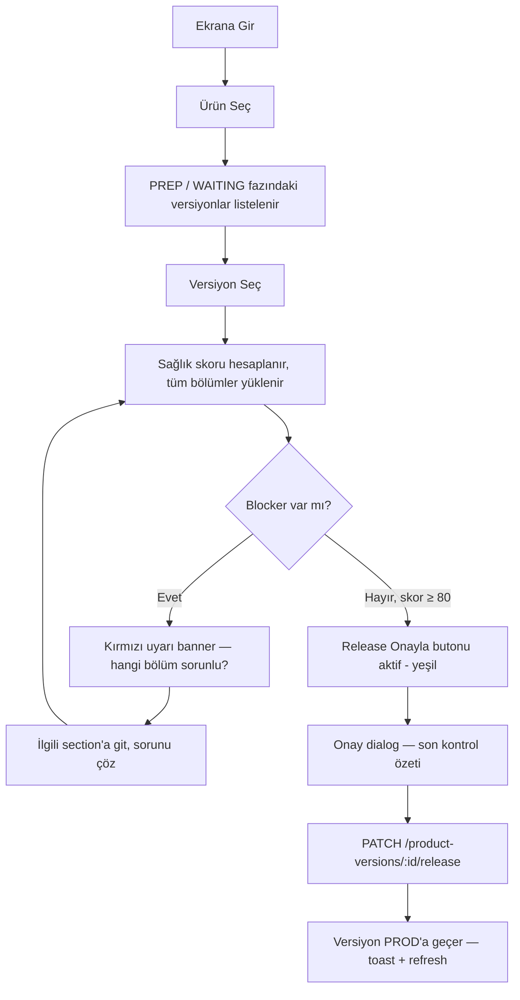

# Release Health Check — Command Center (v3)

**Tarih:** 23 Şubat 2026  
**Kategori:** Command Center  
**Route:** `/release-health-check`  
**Spec:** `designs/specs/release-health-check-v3.md`  
**Öncelik:** P1

---

## Amaç

"Bu versiyon bugün üretime çıkabilir mi?" sorusunu yanıtlamak. Release Manager, belirli bir ürün versiyonunu seçer; ekranda o versiyona ait tüm sağlık sinyalleri (BoM durumu, PR listesi, work item'lar, release note'lar, sistem değişiklikleri, release todo'lar) dikey olarak sıralanır ve tek bir karar desteği sağlanır.

---

## Kullanıcı Rolleri & Perspektifleri

| Rol | Bu ekranda ne arar? | Kritik veri |
|---|---|---|
| **Release Manager** | Versiyon deploy'a hazır mı? | Sağlık skoru, blokaj sayısı, PR / todo durumu |
| **Team Lead** | Risk nerede? Kim ne yapmıyor? | Breaking change, açık PR, hazır olmayan release note |
| **Yönetici** | Kısaca: "Hazır mıyız?" | Sağlık skoru + "Release Onayla" aktif mi |

---

## Kullanıcı Hikayesi

> "Release Manager olarak seçili versiyon için BoM, PR, work item, release note, sistem değişikliği ve todo durumunu tek ekranda görmek ve deployment kararı verebilmek istiyorum."

---

## Ekran Akışı



---

## ASCII Layout Taslağı

```
┌────────────────────────────────────────────────────────────────────────────┐
│ STICKY HEADER (her scroll pozisyonunda görünür)                            │
│                                                                            │
│  Release Health Check                                    [🔄 Yenile]       │
│  [Ürün: Cofins        ▼]  [Versiyon: v1.5.0 — PREP ▼]                     │
│                                                                            │
│  ┌──────────────┐  ┌──────────────────────────────────────────────────┐   │
│  │  🟡 64/100   │  │ ⚠ 2 açık PR  ❌ 1 P0 todo  ⚡ 1 breaking change │   │
│  │  Sağlık Skoru│  │                                                  │   │
│  └──────────────┘  └──────────────────────────────────────────────────┘   │
│                                                [Release Onayla ✅] (disabled) │
├────────────────────────────────────────────────────────────────────────────┤
│                                                                            │
│  SECTION 1 — Bill of Materials (BoM)                               ❌      │
│  ┌──────────────────────────────────────────────────────────────────────┐  │
│  │ ▼ Ödeme Servisleri (ModuleGroup)                                     │  │
│  │    ▼ Core Banking (Module)                                           │  │
│  │      cofins-service-api    | Katalog: 1.0.45 | Prep: 1.0.47 | ⚠ Fark│  │
│  │      cofins-auth-service   | Katalog: 2.1.3  | Prep: 2.1.3  | ✅ OK │  │
│  │      cofins-report-api     | Katalog: 1.3.0  | Prep: —      | ⚪  — │  │
│  │    ▼ Notification (Module)                                           │  │
│  │      cofins-notify-svc     | Katalog: 3.0.1  | Prep: 3.0.1  | ✅ OK │  │
│  └──────────────────────────────────────────────────────────────────────┘  │
│                                                                            │
│  SECTION 2 — Pull Requests                                         ⚠      │
│  ┌──────────────────────────────────────────────────────────────────────┐  │
│  │ ▼ cofins-service-api  (2 PR — 1 açık)                                │  │
│  │   [OPEN]   feature/payment-v2       → main   15 Şub  [→ Azure]      │  │
│  │   [MERGED] fix/timeout-issue        → main   18 Şub  [→ Azure]      │  │
│  │ ▼ cofins-auth-service  (1 PR — tümü merged)                          │  │
│  │   [MERGED] security/jwt-refresh     → main   22 Şub  [→ Azure]      │  │
│  └──────────────────────────────────────────────────────────────────────┘  │
│                                                                            │
│  SECTION 3 — Work Items                                            ✅      │
│  ┌──────────────────────────────────────────────────────────────────────┐  │
│  │  ID     │ Başlık                  │ Tür     │ Durum       │ Atanan  │  │
│  │  #4521  │ Payment v2 entegrasyonu │ Feature │ In Progress │ Ahmet K │  │
│  │  #4388  │ JWT timeout düzeltme   │ Bug     │ Done        │ Zeynep  │  │
│  └──────────────────────────────────────────────────────────────────────┘  │
│                                                                            │
│  SECTION 4 — Release Notes                                         ⚠      │
│  ┌──────────────────────────────────────────────────────────────────────┐  │
│  │  #4521  │ Payment v2 entegrasyonu │ [Eksik ❌]                        │  │
│  │  #4388  │ JWT timeout düzeltme   │ [Hazır ✅]  ▼ Özet göster        │  │
│  └──────────────────────────────────────────────────────────────────────┘  │
│                                                                            │
│  SECTION 5 — Sistem Değişiklikleri                                 ❌      │
│  ┌──────────────────────────────────────────────────────────────────────┐  │
│  │  ⚡ [BREAKING]  validatePayment — POST /api/v1/payments/validate     │  │
│  │     cofins-service-api │ Request model değişti: +transactionId       │  │
│  │                                           [Detayı Gör ▼]            │  │
│  │  ✅           addNotification  — POST /api/v1/notify                │  │
│  │     cofins-notify-svc  │ Yeni endpoint eklendi                      │  │
│  └──────────────────────────────────────────────────────────────────────┘  │
│                                                                            │
│  SECTION 6 — Release Todos                                         ❌      │
│  ┌──────────────────────────────────────────────────────────────────────┐  │
│  │ GEÇİŞ ÖNCESİ                                                         │  │
│  │  ☐ [P0] DB migration scripti çalıştır        DevOps                  │  │
│  │  ☑ [P1] Müşteri iletişimi gönder            Delivery                 │  │
│  │ GEÇİŞ ANINDA                                                          │  │
│  │  ☑ [P1] Cache flush                          DevOps                  │  │
│  │ GEÇİŞ SONRASI                                                         │  │
│  │  ☐ [P2] Smoke test çalıştır                  QA                      │  │
│  └──────────────────────────────────────────────────────────────────────┘  │
└────────────────────────────────────────────────────────────────────────────┘
```

---

## Bileşenler

### STICKY HEADER

| Eleman | Tür | Davranış |
|---|---|---|
| Sayfa başlığı | `Typography variant="h5"` | Sabit metin |
| Ürün seçici | `FormControl / Select` | onChange → version listesi güncellenir, tüm queryler sıfırlanır |
| Versiyon seçici | `FormControl / Select` | Sadece `computePhase === 'PREP' \|\| 'WAITING'` versiyonlar listelenir |
| Sağlık skoru | `CircularProgress determinate` + sayı | Client-side hesaplanır, renk: ≥80 success, 60–79 warning, <60 error |
| Engel özet bandı | `Box` inline chips | Açık PR sayısı, P0 todo sayısı, breaking change sayısı — sıfırsa gizli |
| Release Onayla | `Button variant="contained" color="success"` | `disabled` koşulu: `skor < 80 \|\| p0TodoCount > 0 \|\| openPRCount > 0` |
| Yenile | `IconButton` + `RefreshIcon` | Tüm query'leri invalidate eder |

**Sağlık Skoru Formülü (client-side):**
```
başlangıç = 100
- her aktif/open PR      : -3
- her başarısız pipeline : -10   (V4'te eklenecek — V3 kapsam dışı)
- her tamamlanmamış P0 todo : -5
- her breaking change    : -10
minimum = 0
```

**Sticky Header MUI uygulama notu:**
```tsx
<Box sx={{ position: 'sticky', top: 0, zIndex: 100, bgcolor: 'background.paper',
           borderBottom: '1px solid', borderColor: 'divider', p: 2 }}>
```

---

### SECTION 1 — Bill of Materials (BoM)

**Section başlık satırı:**
```
📦 Servis Versiyonları (BoM)           [bölüm durumu ikonu]  [▲/▼ Daralt]
```

Durum ikonu: `✅` tüm servisler snapshot'lı ve PR değişikliği yok | `⚠️` yeni PR'lar var | `⚪` hiç snapshot yok

**Layout:** Collapsible accordion — ilk açılışta **genişletilmiş**

**Hiyerarşi:**
```
MUI Accordion (ModuleGroup, koyu başlık)
  └── MUI Paper (Module, iç başlık)
        └── MUI Table (Service satırları)
```

**Tablo kolonları:**

| Kolon | Tür | Açıklama |
|---|---|---|
| Servis Adı | `Chip color="primary" variant="outlined"` | `repoName` veya `name` |
| Katalog Versiyonu | `Typography fontFamily="monospace"` | DB'deki `lastProdReleaseName` |
| Son Prep Release | `Typography variant="body2"` | `lastPrepReleaseName` — DB'den gelir (Azure'dan değil) |
| Son Prep Tarihi | `Typography variant="caption" color="text.secondary"` | `lastPrepReleaseDate` — `DD Ay YYYY, HH:mm` formatında; null ise `—` |
| Yeni PR'lar | `Chip size="small"` | Yeşil "Değişiklik yok" / Mavi "N yeni PR" / Gri "Hiç yayınlanmadı" |
| Güncelle | `IconButton size="small"` | 🔄 simgesi — servis bazlı prep refresh |

**Son Prep Release & Tarih Kolon Davranışı:**

Veri kaynağı: **DB** (`services.lastPrepReleaseName` + `services.lastPrepReleaseDate`). Azure'a gerçek zamanlı istek atılmaz — sadece kullanıcı 🔄 butonuna basınca güncellenir.

| Koşul | Gösterim |
|---|---|
| `lastPrepReleaseName` dolu | Release adı (`fontFamily: monospace`) |
| `lastPrepReleaseName` null | `—` |
| `lastPrepReleaseDate` dolu | `DD Ay YYYY, HH:mm` — örn. `23 Şub 2026, 14:35` |
| `lastPrepReleaseDate` null | `—` |

**🔄 Servis Satırı Refresh Butonu:**

Her servis satırının sonundaki `IconButton` (🔄):

```
1. Kullanıcı 🔄 'a basar
2. Buton spinner'a döner, disabled
3. Backend: GET /api/tfs/last-prep-releases?productId=X&serviceId=Y
4. Backend Azure'dan release adı + tarihi alır
5. Backend: PATCH /api/services/:id { lastPrepReleaseName, lastPrepReleaseDate }
6. Frontend: query invalidate → satır güncellenir
7. Spinner biter, buton tekrar aktif
8. Hata: satır altında inline mini Alert (error)
```

Alt endpoint notu: frontend doğrudan `PATCH /api/services/:id` yazmaz — `POST /api/tfs/refresh-prep-release?productId=X&serviceId=Y` tek çağrısı hem Azure'u çeker hem DB'ye yazar. Bu proxy yaklaşımı, frontend'in Azure PAT'ını bilmesine gerek kalmamasını sağlar.

**Section Header — Tümünü Yenile:**

Section başlık satırına `IconButton` (🔄 + "Tümünü Yenile" tooltip) eklenir. Tıklandığında:
- `releaseName` dolu olan tüm servisler için sırayla (ard arda) refresh çağrısı yapılır
- Her servis sonucu bağımsız — biri hata verse diğerleri devam eder
- Section header'da `LinearProgress` gösterir (kaçıncı / kaç tane)
- Bitince: başarı/hata özeti `Tooltip` veya `Snackbar` ile

**Prep Fetch Mantığı (değişmedi):**

| Konfigürasyon | Azure Sorgusu | Kaydedilen |
|---|---|---|
| `releaseName` dolu + `prepStageName` dolu | VSRM → `prepStageName` environment'ı `succeeded` olan en son release + `createdOn` | `lastPrepReleaseName` + `lastPrepReleaseDate` |
| `releaseName` dolu + `prepStageName` boş/null | VSRM → en son tetiklenen release (`$top=1`) + `createdOn` | `lastPrepReleaseName` + `lastPrepReleaseDate` |
| `releaseName` boş | Atlanır | — |

> **İş kuralı:** Prep bilgisi artık DB'ye kaydedilir ve sayfa her açılışında Azure çağrısı yapılmaz. Kullanıcı bilinçli "Güncelle" dediğinde Azure sorgusunu tetikler.

**Yeni PR'lar Kolon Davranışı:**

| Koşul | Chip |
|---|---|
| Snapshot var, 0 yeni PR | `Chip color="success"` "Değişiklik yok" |
| Snapshot var, N > 0 PR | `Chip color="primary"` "N yeni PR" — tıklanınca o servis için mini PR listesi popover açılır |
| Snapshot yok | `Chip color="default"` "Hiç yayınlanmadı" + `WarningAmberIcon` |

**Yeni PR Mini Popover (Chip'e tıklanınca):**
```
┌─────────────────────────────────────────────────────────┐
│ cofins-service-api — Release-47'den bu yana 2 PR        │
├─────────────────────────────────────────────────────────┤
│ [MERGED] feature/payment-v2    → main   20 Şub   [↗]  │
│ [MERGED] fix/report-timeout    → main   22 Şub   [↗]  │
└─────────────────────────────────────────────────────────┘
```
Uygulama: `MUI Popover` — `anchorEl` state ile, chip tıklanınca açılır.

**Veri kaynağı:**
- Servis hiyerarşisi: `GET /api/products/:id` → `moduleGroups → modules → services`
- Snapshot'lar: `GET /api/service-release-snapshots?productId={id}` → her servis için en son snapshot
- PR delta: mevcut yüklü `prsForScore` listesinden `repoName` + `snapshot.releasedAt` filtresiyle client-side hesaplanır

**Boş state:** "Bu ürün için modül/servis tanımlı değil — Ürün Kataloğu'ndan ekleyin"

**Sağlık skoru etkisi:** 
- Snapshot olmayan servis sayısı > 0 → header'da sarı "? snapshot eksik" badge (skor kesintisi yok)
- BoM'da fark olan servis → warning (skor kesintisi yok, v3 öncesinden aynı)

---

### SECTION 2 — Pull Requests

**Section başlık satırı:**
```
🔀 Pull Requests          Toplam: 14   Açık: 2   Merged: 12   [bölüm durumu]  [▲/▼]
```

Durum: tüm merged → `✅` | açık PR var → `⚠️` | abandoned PR var → `❌`

**Layout:** Servis (repo) bazında gruplandırılmış accordion listesi. Her servis bir `Accordion`.

**Her servis accordion başlığı:**
```
📁 cofins-service-api   (2 PR — 1 açık)           [⚠️]
```

**Her PR satırı (accordion detay):**

| Alan | Bileşen | Notlar |
|---|---|---|
| Durum | `Chip` | active → warning, merged → success, abandoned → error |
| PR Başlığı | `Typography` truncate | |
| Kaynak branch | `Typography variant="caption" fontFamily="monospace"` | |
| Tarih | `Typography variant="caption"` | `DD Ay` formatı |
| Azure linki | `IconButton + OpenInNewIcon` | `href` ile Azure DevOps'ta açar |

**İş kuralı — PR filtresi:** Son release'in `preProdDate`'inden bu yana oluşturulanlar. Backend'den tüm PR gelir, frontend `createdDate > preProdDate` ile filtreler.

**İş kuralı — Work Item toplama:** PR'ların `workItemRefs` alanından ID'ler toplanır → Section 3'e `passedWorkItemIds` state olarak iletilir.

**Veri kaynağı:** `GET /api/tfs/pull-requests?productId={productId}`

**Azure yapılandırma yoksa:** Tüm section yerine `Alert severity="info"`: "Bu ürün için Azure DevOps yapılandırılmamış. Ürün Kataloğu'ndan ekleyin."

**Boş state (yapılandırma var ama PR yok):** "Son release tarihinden bu yana açılmış PR bulunamadı."

---

### SECTION 3 — Work Items

**Section başlık satırı:**
```
📋 Work Items          Toplam: 23   Done: 18   In Progress: 5   [bölüm durumu]  [▲/▼]
```

Durum: tüm Done → `✅` | in progress var → `⚠️`

**Layout:** MUI Table (düz liste, servis etiketiyle)

**Tablo kolonları:**

| Kolon | Tür | Notlar |
|---|---|---|
| ID | `Link` → Azure DevOps | Tıklayınca yeni tab |
| Başlık | `Typography` | |
| Tür | `Chip size="small"` | Bug → error, Feature → primary, Task → default |
| Durum | `Chip size="small"` | Done → success, In Progress → warning, New → default |
| Atanan | `Typography variant="caption"` | |
| Kaynak Servis | `Chip size="small" variant="outlined"` | Hangi servisin PR'ından geldi |

**Veri kaynağı:** `GET /api/tfs/work-items?ids={idList}&productId={productId}` — `idList` Section 2'den toplanan ID'ler

**Azure yoksa:** Section 2 ile aynı uyarı banner.

**Boş state:** "PR'lardan work item bulunamadı."

---

### SECTION 4 — Release Notes

**Section başlık satırı:**
```
📝 Release Notes          Hazır: 18/23   Eksik: 5   [bölüm durumu]  [▲/▼]
```

Durum: tümü hazır → `✅` | eksik var → `⚠️`

**Layout:** Work item başına bir satır. Accordion değil, düz tablo — ama "Detay" expand satır içi.

**Tablo kolonları:**

| Kolon | Tür | Notlar |
|---|---|---|
| Work Item ID | `Typography variant="body2"` | |
| Başlığı | `Typography` truncate | |
| Durum | `Chip` | Hazır → success / Eksik → error |
| Özet (sadece Hazır olanlar) | `Typography variant="caption"` | Release note ilk 80 karakteri |
| Detay | `IconButton ExpandMore` | Satırı expand eder → tam release note metni |

**Veri kaynağı:** `GET /api/release-notes?versionId={versionId}` → work item ID'lerine karşı JOIN

**Boş state:** "Bu versiyon için henüz release note girilmemiş."

---

### SECTION 5 — Sistem Değişiklikleri

**Section başlık satırı:**
```
⚡ Sistem Değişiklikleri          Breaking: 1   Normal: 4   [bölüm durumu]  [▲/▼]
```

Durum: breaking change var → `❌` | sadece normal var → `⚠️` | yok → `✅`

**Layout:** İki alt grup: üstte Breaking Change'ler (kırmızı arka plan), altta normal değişiklikler.

**Her değişiklik kartı (Paper variant="outlined"):**
```
[⚡ BREAKING] veya [✅ Normal]   validatePayment   cofins-service-api
POST /api/v1/payments/validate
Açıklama: Ödeme doğrulama API'si — request model değişti
                                                     [Detayı Gör ▼]
```

**Detay expand gösterimi (breaking change için):**
```
Request Model: PaymentValidationRequest
  + transactionId  (string)  — Transaction ID
  + amount         (decimal) — Transaction amount
  - oldAmount      kaldırıldı
```

**Diff gösterimi:** `+` satırları yeşil, `-` satırları kırmızı, monospace font

**Veri kaynağı:** `GET /api/system-changes?versionId={versionId}`

**Boş state:** "Bu versiyon için kayıtlı sistem değişikliği yok."

**Sağlık skoru etkisi:** Her breaking change: -10 puan

---

### SECTION 6 — Release Todos

**Section başlık satırı:**
```
☑ Release Todos          Tamamlanan: 7/9   P0 Eksik: 1   [bölüm durumu]  [▲/▼]
```

Durum: tüm P0 tamam → skor ≥ 80 için gerekli koşul | P0 eksik var → `❌`

**Layout:** Zaman grubuna göre 3 bölüm (her biri Paper içinde)

```
── GEÇİŞ ÖNCESİ ──────────────────────────────────────
  ☐  [P0 ❌]  DB migration scripti çalıştır          DevOps
  ☑  [P1]    Müşteri iletişimi gönder               Delivery

── GEÇİŞ ANINDA ────────────────────────────────────────
  ☑  [P1]    Cache flush                             DevOps

── GEÇİŞ SONRASI ──────────────────────────────────────
  ☐  [P2]    Smoke test çalıştır                     QA
```

**Her todo satırı:**
- `Checkbox` → onChange → `PATCH /api/release-todos/:id` → optimistic update
- Öncelik chip: P0 → error, P1 → warning, P2 → default
- `isCompleted: true` → satır soluk, üstü çizili
- `responsibleTeam`: sağ tarafta `Typography variant="caption" color="text.secondary"`

**Veri kaynağı:** `GET /api/release-todos?versionId={versionId}`

**Boş state:** "Bu versiyon için todo tanımlı değil — Releases sayfasından ekleyin."

**Sağlık skoru etkisi:** Tamamlanmamış P0 todo başına: -5 puan

---

### RELEASE ONAYLA — Onay Dialog

Sticky header'daki "Release Onayla" butonu tıklanınca açılır.

```
┌─────────────────────────────────────────────────────┐
│ 🚀 Release Onayla — v1.5.0                          │
├─────────────────────────────────────────────────────┤
│ Son durum özeti:                                    │
│                                                     │
│  ✅  PR'lar      14 / 14 merged                     │
│  ✅  P0 Todos   3 / 3 tamamlandı                    │
│  ⚠️  Breaking   1 adet — onaylandığı varsayılır     │
│  ✅  Sağlık     82 / 100                            │
│                                                     │
├─────────────────────────────────────────────────────┤
│ 📸 Servis Release Snapshot                          │
│                                                     │
│  Bu işlem aynı zamanda ürünün tüm servislerinin     │
│  mevcut PR listesini kaydeder (Release Snapshot).   │
│  Bir sonraki versiyonda PR delta bu noktadan        │
│  hesaplanacak.                                      │
│                                                     │
│  4 servis snapshot'u güncellenecek.                 │
│                                                     │
├─────────────────────────────────────────────────────┤
│ Bu işlem geri alınamaz.                             │
│                                                     │
│              [İptal]     [Evet, Yayınla →]          │
└─────────────────────────────────────────────────────┘
```

**Buton renk kuralı:** "Evet, Yayınla" → `color="success" variant="contained"`

**API çağrı sırası (sıralı, paralel değil):**
1. `PATCH /api/product-versions/{versionId}/release` — fazı PROD'a taşı
2. `POST /api/service-release-snapshots` — tüm servislerin snapshot'ını kaydet
   - Body: `{ productId, productVersionId, releaseName: otomatik }` 
   - Hata durumunda: toast uyarısı ama dialog kapanır — ana işlem başarılı sayılır

**Başarı sonrası:** `Snackbar` toast + tüm query invalidate + header'ın versiyon seçici güncellenir (artık PROD olduğu için listeden düşer)

**Kısmi snapshot hatası toast:** "Versiyon yayınlandı. X servisin release snapshot'ı alınamadı — manuel kontrol gerekebilir."

---

## Action'lar

| Action | Kim? | Trigger | Sonuç |
|---|---|---|---|
| Ürün seç | Herkes | Dropdown | Version list güncellenir, bölümler sıfırlanır |
| Versiyon seç | Herkes | Dropdown | Tüm 6 section yüklenir |
| Tümünü Yenile | Herkes | 🔄 buton | Tüm TanStack Query cache invalidate |
| Section daralt/genişlet | Herkes | Chevron ikonu | Sadece UI state |
| PR → Azure'da Aç | Herkes | `OpenInNew` butonu | Yeni sekme |
| Work Item → Azure'da Aç | Herkes | ID linki | Yeni sekme |
| Release Note Detay | Herkes | `ExpandMore` | Satır inline genişler |
| Sistem Değişikliği Detay | Herkes | `ExpandMore` | Model diff görünür |
| Todo Tamamla/Geri Al | Herkes | Checkbox | `PATCH /release-todos/:id` → optimistic |
| Release Onayla | Release Manager | Büyük buton | Dialog → `PATCH /product-versions/:id/release` |

---

## API Bağlantıları

| Method | Endpoint | Ne zaman? |
|---|---|---|
| GET | `/api/products` | Sayfa açılışında |
| GET | `/api/product-versions?productId={id}` | Ürün seçilince |
| GET | `/api/products/{id}` | Versiyon seçilince (BoM için) |
| GET | `/api/tfs/pull-requests?productId={id}` | Versiyon seçilince (`enabled: !!versionId && pmType==='AZURE'`) |
| GET | `/api/tfs/work-items?ids={list}&productId={id}` | PR'lar yüklenince, ID listesi hazır olunca |
| GET | `/api/release-notes?versionId={id}` | Versiyon seçilince |
| GET | `/api/system-changes?versionId={id}` | Versiyon seçilince |
| GET | `/api/release-todos?versionId={id}` | Versiyon seçilince |
| PATCH | `/api/release-todos/{id}` | Todo checkbox toggle |
| PATCH | `/api/product-versions/{id}/release` | Onay dialog confirm |
| GET | `/api/service-release-snapshots?productId={id}` | BoM section açılınca (son snapshot per servis) |
| POST | `/api/service-release-snapshots` | Onay dialog confirm sonrası (release snapshot kaydet) |

**React Query cache stratejisi:**
- `staleTime: 60_000` (1 dk) — sık değişmeyen veriler (BoM, system-changes)
- `staleTime: 0` (her odakta refetch) — PR ve todo
- `enabled: !!selectedVersion` — versiyon seçilmeden hiçbir query çalışmaz

---

## State Yönetimi

```typescript
// Selector state
const [selectedProduct, setSelectedProduct] = useState('');
const [selectedVersion, setSelectedVersion] = useState('');

// Section collapse state (localStorage'da saklanabilir)
const [collapsed, setCollapsed] = useState<Record<string, boolean>>({
  bom: false, prs: false, workItems: false,
  releaseNotes: false, systemChanges: false, todos: false,
});

// PR → Work Item köprüsü
const [collectedWorkItemIds, setCollectedWorkItemIds] = useState<number[]>([]);

// Dialog
const [approveOpen, setApproveOpen] = useState(false);

// Sağlık skoru (useMemo)
const healthScore = useMemo(() => {
  let score = 100;
  score -= openPRs.length * 3;
  score -= incompletP0Todos.length * 5;
  score -= breakingChanges.length * 10;
  return Math.max(0, score);
}, [openPRs, incompletP0Todos, breakingChanges]);
```

---

## Loading State

Her section bağımsız yüklenir. Veri gelene kadar `Skeleton` göster:

```tsx
// Section içinde:
{isLoading ? (
  <>
    <Skeleton variant="rectangular" height={40} sx={{ mb: 1 }} />
    <Skeleton variant="rectangular" height={40} sx={{ mb: 1 }} />
    <Skeleton variant="rectangular" height={40} />
  </>
) : (
  /* gerçek içerik */
)}
```

Sticky header'daki skor: tüm veriler yüklenene kadar `CircularProgress indeterminate` göster, skor yerine `—`

---

## Boş State

| Durum | Ne gösterilir? |
|---|---|
| Versiyon seçilmedi | Orta alan: ilustrasyon + "Bir ürün ve versiyon seçin" |
| PR yok | "Son release tarihinden bu yana PR bulunamadı" |
| Azure yapılandırılmamış | `Alert info`: "Azure DevOps yapılandırılmamış — Ürün Kataloğu'ndan ekleyin" |
| Tüm todolar tamam | "🎉 Tüm todolar tamamlandı" |
| BoM tanımlı değil | "Modül veya servis tanımlı değil" |

---

## Hata State

| Hata | Kullanıcıya gösterilen |
|---|---|
| TFS API hatası | İlgili section içinde: `Alert severity="error"` + Yenile butonu |
| Backend 500 | Section başlığı yanında kırmızı yıldırım ikonu + "Yüklenemedi [↻]" |
| Todo PATCH hatası | Optimistic update geri alınır + `Snackbar error` |
| Release onayla hatası | Dialog açık kalır + `Alert severity="error"` içinde mesaj |

---

## Frontend Developer Notları

- **Sayfa layout:** Standart `<Layout>` wrapper içinde — full width kullanılır, sidebar sol'da normal
- **Sticky header:** `position: sticky; top: 64px` (Layout'un AppBar yüksekliği)
- **Section bileşen pattern:** Her section ayrı component — `<BomSection>`, `<PrSection>` vb. Props: `{ versionId, productId, onWorkItemsCollected? }`
- **Work item köprüsü:** `<PrSection onWorkItemsCollected={(ids) => setCollectedWorkItemIds(ids)} />` — PR query resolve olunca callback tetikler
- **Breaking change satır vurgusu:** DataGrid yerine düz Paper — `sx={{ bgcolor: 'error.50' }}` ile
- **Diff render:** `+` satırları `color: 'success.main'`, `-` satırları `color: 'error.main'`, `fontFamily: 'monospace'`
- **Onay dialog özeti:** Prop olarak geçilen live değerler — dialog açıldığı anda o anki sayıları gösterir
- **`computePhase` import:** `@/lib/versionPhase` — versiyon filtresi için kullanılır

---

## Kapsam Dışı — V3

| Özellik | Neden dışarıda |
|---|---|
| Pod / Kubernetes durumu | MCP server entegrasyonu ayrı sprint |
| Pipeline durumu | V4'e bırakıldı |
| Devam eden geliştirme PR'ları | Odak dağıtıyor; ayrı ekran |
| Hotfix yayınlama | Hotfix Merkezi sayfasına ait |
| Release note yazma / düzenleme | Release Notes sayfasına ait |
| PR approve / merge | Tehlikeli. Kapsam dışı |
| n8n direkt çağrıları | Backend proxy zorunludur |

---

## TASK-011 — Otomatik Paket Üretimi + Müşteri Paket Filtresi

**Tarih:** 2026-03-06

### Değişen Yapı: Wizard Sadeleşmesi

**Önceki:** 3 adım — Son Kontrol → Paket Oluştur → Yayınla
**Yeni:** 2 adım — Son Kontrol → Yayınla

"Paket Oluştur" adımı tamamen kaldırılır. Backend ürünün `supportedArtifactTypes` alanına göre paketi otomatik oluşturur.

### Yeni Wizard Tasarımı

```
┌────────────────────────────────────────────────────────┐
│  🚀 Release Yayınla — Ethix NG v1.1.0               X │
├────────────────────────────────────────────────────────┤
│                                                        │
│   [Son Kontrol] ──────► [Yayınla]                     │
│        ●                    ○                          │
│                                                        │
├────────────────────────────────────────────────────────┤
│  [ADIM 0 — SON KONTROL]                               │
│                                                        │
│  ✅ Açık PR'lar        Tümü merged                    │
│  ✅ P0 Todo'lar        Tümü tamamlandı                │
│  ⚠️  Breaking Change    1 adet                         │
│  ✅ Release Note       Tümü mevcut                    │
│  ✅ Sağlık Skoru       95/100                         │
│                                                        │
│  ───────────────────────────────────────────────────  │
│  📦 Otomatik oluşturulacak paketler:                  │
│     • Docker Image  (ethix-ng-v1.1.0)                 │
│     • Binary        (ethix-ng-v1.1.0)                 │
│  (Ürünün supportedArtifactTypes listesinden)          │
│                                                        │
│                     [İptal]  [Devam →]                │
└────────────────────────────────────────────────────────┘

┌────────────────────────────────────────────────────────┐
│  [ADIM 1 — YAYINLA]                                   │
│                                                        │
│  ℹ️  "Ethix NG v1.1.0" PRODUCTION'a alınacak.         │
│                                                        │
│  Otomatik oluşturulacak:                               │
│  • Docker Image paketi                                 │
│  • Binary paketi                                       │
│                                                        │
│  Bu işlem geri alınamaz.                              │
│                                                        │
│              [← Geri] [İptal] [🚀 Yayınla]           │
└────────────────────────────────────────────────────────┘
```

### Artifact Tipi → Paket Tipi Eşlemesi

| Product.supportedArtifactTypes | Oluşan VersionPackage.packageType |
|-------------------------------|-----------------------------------|
| `DOCKER`                      | `DOCKER_IMAGE`                    |
| `BINARY`                      | `BINARY`                          |
| `GIT_SYNC`                    | `GIT_ARCHIVE`                     |

### Müşteri Paket Filtresi — CustomerProductVersionsPage

Paketler sekmesinde yalnızca müşterinin `CPM.artifactType`'ıyla eşleşen paketler gösterilir:

| CPM.artifactType | Gösterilen packageType'lar |
|---|---|
| `DOCKER` | `DOCKER_IMAGE` |
| `BINARY` | `BINARY` |
| `GIT_SYNC` | `GIT_ARCHIVE` |
| `null` veya eşleşme yok | Tümü (fallback) |
| `ON_PREM + IAAS` | + `HELM_CHART` eklenir |

**Boş state:**
```
┌───────────────────────────────────────┐
│  📦 İndirilebilir Paketler            │
│                                       │
│  Bu versiyon için eşleşen paket yok. │
│                                       │
└───────────────────────────────────────┘
```

### Handoff Notları — UX → Backend + Frontend

**Backend:** `/product-versions/:id/release` endpoint'i `Product.supportedArtifactTypes`'ı oku → her tip için `VersionPackage` oluştur. Duplicate check: aynı `productVersionId + packageType` ikinci kez oluşturulmasın.

**Frontend — ReleaseHealthCheckPage:**
- `ApproveDialog` wizard'ından Step 1 (Paket Oluştur) kaldırılır
- Step 0'a "Otomatik oluşturulacak paketler" bilgi satırı eklenir
- `onConfirm(packages)` çağrısında packages artık boş dizi `[]` gönderilir

**Frontend — CustomerProductVersionsPage:**
- `VersionPackagesSection` içinde paket listesi `cpmArtifactType` + `deploymentModel` + `hostingType`'a göre filtrelenir
- Filtre `filterPackagesByArtifactType(packages, cpmArtifactType, deploymentModel, hostingType)` adlı yardımcı fonksiyon olarak yazılır

- RM Review bekleniyor: Hayır (akışkan mod)


